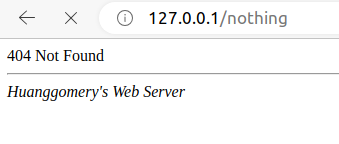
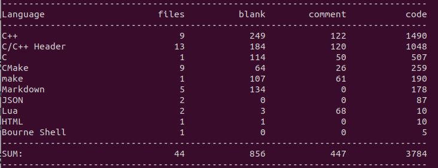

# C++ Linux High Performance Web Server for Multiple Applications


## Introduction

本项目是一个Web服务器，参考游双老师和陈硕老师的书。使用Reactor模型，能解析GET和POST请求，支持长短连接，使用异步日志。


## Why Multiple Applications?
本项目所有的组件，包括线程池、Epoll模块、定时器，全部使用C++的类模板编写，模板参数是具体的任务类。因此使用者可以根据需要，开发自己的Web应用，具体如何使用参考src/BaseTask.h中的注释说明。
本项目中已经包含了两个任务类：
+ EchoTask 对收到的数据的英文字母进行大小写互换后发回客户端
+ HttpTask 响应Http请求


## Environment

+ OS: Ubuntu 20.04
+ Compiler:  g++ 9.4.0


## Build

```shell
./build.sh
```


## Usage

```shell
cd build
sudo ./HttpServer [-p port] [-t thread_numbers]
```


## 浏览器测试

使用浏览器，地址输入http://127.0.0.1

即可得到如下页面

	

输入不存在的URL，会得到404 NOT FOUND

	

## 代码统计

	
